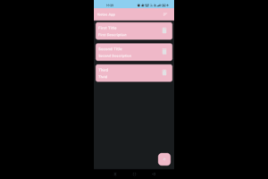
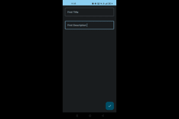
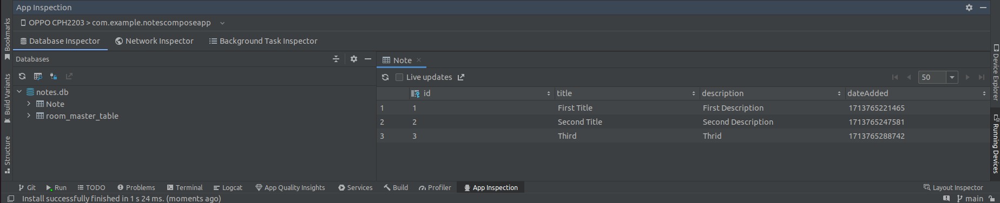

# NotesComposeApp

## Overview

NotesComposeApp is a simple Android application built using Jetpack Compose and Room database. It allows users to create, view, and delete notes.

## Workflow

1. **Note Screen**: Upon launching the app, users are presented with a list of notes. They can view existing notes, delete notes, or add new notes.

2. **Adding a Note**: Users can tap on the floating action button (`+`) to navigate to the Add Note screen. Here, they can enter a title and description for the new note and save it by tapping the checkmark icon.

3. **Viewing a Note**: Each note is displayed with its title and description on the Note Screen. Users can tap on a note to view its details.

4. **Deleting a Note**: Users can delete a note by tapping the delete icon next to the note on the Note Screen.

5. **Sorting Notes**: Users can sort notes either by title or by date added. Tapping on the sort icon on the top right of the Note Screen toggles between the sorting options.

## Screenshots

<!-- Include screenshots of your app's UI here -->

**Note Screen**

**Add Note Screen**

**Room Database**

## Logic

### Data Layer

- `Note`: Data class representing a single note with properties like id, title, description, and date added.
- `NoteDao`: Data Access Object (DAO) interface defining database operations like inserting, deleting, and querying notes.
- `NoteDatabase`: Room database class containing a DAO instance.

### Presentation Layer

- `NoteState`: Data class representing the state of the Note Screen, including the list of notes and the currently entered title and description for adding a new note.
- `NoteViewModel`: ViewModel class responsible for handling business logic and managing the UI state.
- `NoteScreen`: Composable function for displaying the Note Screen, including the list of notes and the floating action button for adding a new note.
- `AddNoteScreen`: Composable function for displaying the Add Note Screen, including text fields for entering a new note's title and description.
- `NoteItem`: Composable function for displaying an individual note item, including its title, description, and delete button.

### MainActivity

- Initializes the Room database instance.
- Creates and observes the ViewModel's state using Jetpack Compose's `collectAsState`.
- Sets up navigation using Jetpack Compose's `NavHost` and `composable` functions.

## Technologies Used

- Jetpack Compose: Modern Android UI toolkit for building native UIs.
- Room Database: Persistence library providing an abstraction layer over SQLite.
- Kotlin Coroutines: For asynchronous programming and managing background tasks.
